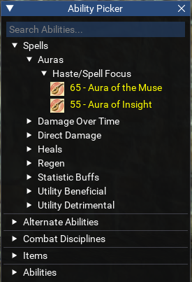
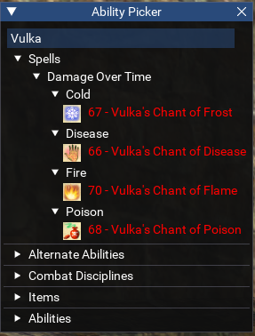
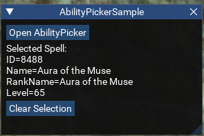

# Ability Picker

AbilityPicker is a utility for selecting EverQuest abilities via a UI.  

A sample script is provided to demonstrate how it may be used. Copy `abilitypicker` folder to your MQ `lua` folder and `/lua run abilitypicker`.  

   
   

## Overview

AbilityPicker provides a UI for selecting abilities, such as for configuring what abilities to use in some automation script.  

### Usage:

```lua
-- Somewhere in main script execution:
local AbilityPicker = require('AbilityPicker')
AbilityPicker.InitializeAbilities()

-- Somewhere during ImGui callback execution:
AbilityPicker.DrawAbilityPicker()

-- Somewhere in main script execution:
if AbilityPicker.Selected then
    -- Process the item which was selected by the picker
    printf('Selected %s: %s', AbilityPicker.Selected.Type, AbilityPicker.Selected.Name)
    AbilityPicker.ClearSelection()
end
```

### Output

When an ability is selected, AbilityPicker.Selected will contain the following values:  

When `Type` == `'Spell'`
- ID
- Name
- RankName
- Level  

When `Type` == `'Disc'`
- ID
- Name
- RankName
- Level  

When `Type` == `'AA'`
- ID
- Name  

When `Type` == `'Item'`
- ID
- Name
- SpellName  

When `Type` == `'Ability'`
- ID
- Name  

## TODO

- Add more info about abilities where available
- Add support for registering custom categories, for example adding a list of commands like for KA `command:/somecommand` type stuff